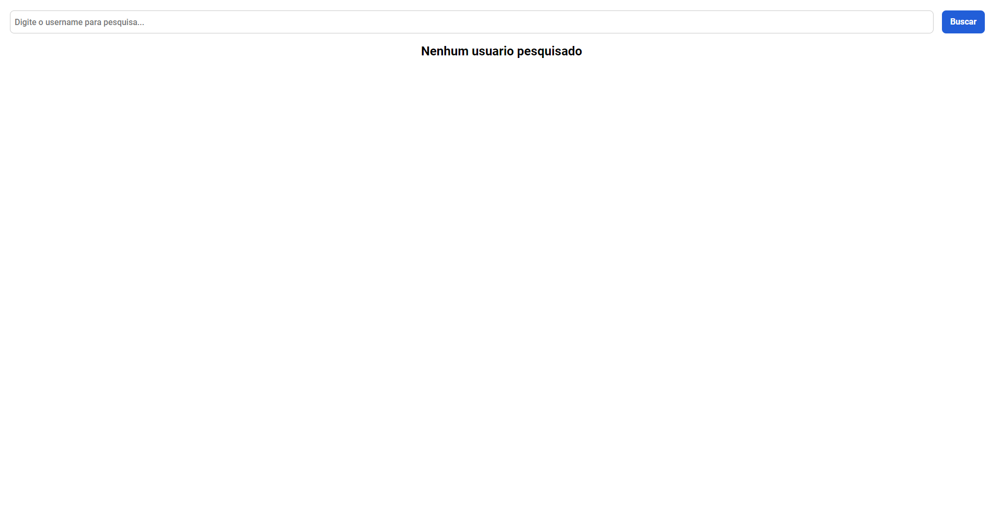

# Criando um front-end totalmente componentizado na prática com ReactJS

[Create React App](https://github.com/facebook/create-react-app).

## Sobre o projeto

Projeto criado durante o bootcamp Take Blip Fullstack Developer #2 da [Digital Innovation One](https://web.dio.me/home)

Aplicação criada para consumo da api pública do github.

### Features

- Procurar infos por username
- Procurar repo por username
- Procurar starred (com estrela) por username

### Preview

Prints do projeto finalizado.

### Libraries used

- [axios](https://www.npmjs.com/package/axios)
- [react-tabs](https://www.npmjs.com/package/react-tabs)
- [styled-components](https://styled-components.com/)

## Available Scripts

In the project directory, you can run:

### `yarn start`

Executa o aplicativo no modo de desenvolvimento.\
Abra [http://localhost:3000](http://localhost:3000) para visualizá-lo no navegador.

A página será recarregada se você fizer edições.\
Você também verá quaisquer erros de lint no console.

### `yarn test`

Inicia o executor de teste no modo de observação interativo.\
Consulte a seção sobre [running tests](https://facebook.github.io/create-react-app/docs/running-tests) para obter mais informações.

### `yarn build`

Compila o aplicativo para produção na pasta `build`.\
Ele agrupa corretamente o React no modo de produção e otimiza a construção para o melhor desempenho.

A compilação é reduzida e os nomes dos arquivos incluem os hashes.\
Seu aplicativo está pronto para ser implantado!

Consulte a seção sobre [deployment](https://facebook.github.io/create-react-app/docs/deployment) para obter mais informações.

### `yarn eject`

**Nota: esta é uma operação unilateral. Depois de dar `eject`, você não pode voltar atrás!**

Se você não estiver satisfeito com a ferramenta de construção e as opções de configuração, poderá dar `eject` a qualquer momento. Este comando removerá a dependência de compilação única de seu projeto.

Em vez disso, ele copiará todos os arquivos de configuração e as dependências transitivas (webpack, Babel, ESLint, etc) diretamente para o seu projeto para que você tenha controle total sobre eles. Todos os comandos, exceto `eject` ainda funcionarão, mas eles irão apontar para os scripts copiados para que você possa ajustá-los. Neste ponto, você está sozinho.

Você nunca precisa usar `eject`. O conjunto de recursos selecionados é adequado para implantações pequenas e médias, e você não deve se sentir obrigado a usar esse recurso. No entanto, entendemos que esta ferramenta não seria útil se você não pudesse personalizá-la quando estiver pronto para ela.
